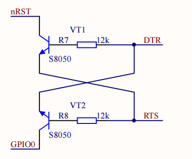

Fixing Reset-on-Connect Issue / Broken Reset Circuits
=====================================================

Regarding to Issue #14

Build-In Reset Circuit
----------------------

The original [NodeMCU DEVKIT](https://github.com/nodemcu/nodemcu-devkit-v1.0) includes a build-in circuit to pull down the reset (RST) and/or flash (GPIO0) pins via the serial connection using the DTR/RTS lines.
This allows the user to execute a hard-reset or flash command via software.

**Reset Circuit** (from [NodeMCU DEVKIT Schematics](https://github.com/nodemcu/nodemcu-devkit-v1.0/blob/master/NODEMCU_DEVKIT_V1.0.PDF))




The Issue
---------------------
It's a very useful feature, but on some modules these circuits cause a **reset on connect** which make the module inaccessible with NodeMCU-Tool: 
on opening the serial connection software side, the module will be reset immediately and it reboots. Directly after reboot, the **auto-baudrate** detection of NodeMCU is capturing the serial input to determinate the used baudrate.
And this is the issue: NodeMCU-Tool sends a few hearbeat messages to the module to check its state, but these messages are list because of the auto-baudrate detection. Therefore the module is threatened as unavailable and a error message is raised. 

This behaviour can be caused by a hardware issue: wrong transistors, wrong series-resistors **or** a usb driver failure, which invokes the DTR/RTS lines asynchronous

**Timeline**

1. **NodeMCU-Tool** is establishing the serial connection
2. DTR/RTS lines are invoked
3. NodeMCU will do a hard-reset or go into flash mode
4. **NodeMCU-Tool** sends heartbeat sequence
5. NodeMCU Auto-Baudrate Detection is capturing the input or the module is not ready yet the receive incoming data
6. **NodeMCU-Tool** will not receive the hearbeat response - the module is threatened as unavailable


How to fix it
---------------------

NodeMCU-Tool v2.0.0 includes a special delay flag `--connection-delay N` which waits **N** milliseconds after establishing the connection and sends additional dummy sequences to trigger the auto-baudrate detection.

**Timeline**

1. **NodeMCU-Tool** establishes the serial connection
2. **NodeMCU-Tool** is waiting **N** milliseconds until the hard-reset/reboot is done
3. **NodeMCU** becomes ready and starts the auto-baudrate detection
4. **NodeMCU-Tool** sends dummy sequence 1 to trigger the auto-baudrate detection
5. **NodeMCU-Tool** is waiting **N** milliseconds for baudrate detection
6. **NodeMCU-Tool** sends dummy sequence 2 to trigger the auto-baudrate detection
7. **NodeMCU-Tool** is waiting **N** milliseconds for baudrate detection
8. **NodeMCU** set its baudrate based on the previous dummy sequences
9. **NodeMCU-Tool** starts the regular heartbeat detection

The connection delay is applied 3 times, between each step. A value between **300...500ms** has been approved as best option.

**Example 1**
```bash
$ ./nodemcu-tool upload helloworld.lua --connection-delay 300 --baud 115200
```
